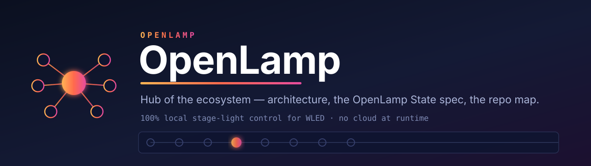

<p align="center"></p>

**Instant, 100% local stage-light control for musicians and makers** — drive cheap
consumer smart LED lamps — **WLED** (recommended) or Tuya / Smart Life — from a Stream Deck, a MIDI
controller or the command line, with ~45 ms response on WLED and zero cloud at runtime.

Made by **BenLab** with the help of Claude.

📍 **[Public roadmap](https://github.com/orgs/openlamp/projects/1)** — what's Now / Next / Later, and where help is wanted.

## The family — one repo per layer

Each layer lives in its own repo so no layer is impacted by the others. **Two
independent paths reach the lamps** — the **engine** (direct, ~45 ms) and **Home
Assistant** — and a shared, firmware-independent **asset layer** dresses the UIs on
both.

**Two names, not interchangeable.** **OpenLamp** is the open ecosystem: this org,
the spec, the engines, every public repo below. **LumiDeck** is the commercial name
of the one thing that is sold — the Stream Deck plugin. No other repo is part of
"the LumiDeck stack".

### What depends on what

```
SPEC        openlamp-spec-midi ......  the MIDI spec. SPEC.md is the ONE place a
                  │                    version is stated; everything else links to it.
                  │ implemented or emitted by
                  ├── openlamp-engine-python   midi.py — the reference implementation
                  ├── openlamp-demo-web        browser, Web MIDI, single HTML file
                  ├── openlamp-pack-ableton    Live clips (mapping generated from the spec)
                  ├── openlamp-pack-bome       any controller, no code
                  ├── openlamp-m4l-prism       Max for Live device
                  └── openlamp-tool-canvas     N devices composed into one canvas

ENGINE      openlamp-engine-python ..  drivers · OLS · local API :8377 · daemon · CLI
                  │ driven over that local API by
                  ├── openlamp-lib-beatsync    Ableton Link / MIDI clock → lamp cues
                  ├── openlamp-addon-beat      HA add-on: vendors engine + beatsync,
                  │                            both pinned to a commit SHA
                  └── lumideck                 PRIVATE — via its own forked engine.py
            openlamp-engine-node ....  ARCHIVED Node port, same OLS, frozen

HOME        openlamp-addon-beat ....  ◀── openlamp-beat-card       (Lovelace panel)
ASSISTANT   HA "wled" integration ..  ◀── openlamp-card-wled-assets (Lovelace card)

ASSETS      wled-assets ............  CC0, vendor-neutral, no dependency of its own
                  └── consumed by openlamp-card-wled-assets, and any WLED client

PRODUCT     lumideck ...............  the Stream Deck plugin — the one thing sold
            lumideck-support .......  its product page + public issue tracker

ORG         openlamp ...............  this hub
            .github ................  the org profile README
```

The engine's WLED-compat endpoint (`/json/state`) lets any WLED-aware tool drive
OpenLamp lamps; no control surface depends on it. The **Home Assistant card is fully
independent of the engine**: it rides HA's own WLED integration and only shares the
`wled-assets` layer with the other frontends.

### Spec

| Repo | What it is | Depends on |
|---|---|---|
| [openlamp-spec-midi](https://github.com/openlamp/openlamp-spec-midi) | the **MIDI↔WLED spec** — notes→colours, CC→brightness/effects, PC→presets, clock/Link→beat. Spec only, MIT. [SPEC.md](https://github.com/openlamp/openlamp-spec-midi/blob/main/SPEC.md) is the single source of truth for its version; implementers link to it rather than restate a number | nothing |

### Engines

| Repo | What it is | Depends on |
|---|---|---|
| [openlamp-engine-python](https://github.com/openlamp/openlamp-engine-python) | the **reference engine** — WLED/Tuya drivers · [OpenLamp State (OLS)](https://github.com/openlamp/openlamp-engine-python/blob/main/OLS.md) · groups · snapshots · animations · local API :8377 · headless daemon · CLI · **MIDI control** (`midi.py`, the spec's reference implementation) | openlamp-spec-midi |
| [openlamp-engine-node](https://github.com/openlamp/openlamp-engine-node) | Node.js port of the engine, same OLS, interchangeable behind the local API. **Archived and frozen** — kept readable, not maintained | — |

### Control surfaces — they emit the spec

| Repo | What it is | Depends on |
|---|---|---|
| [openlamp-pack-ableton](https://github.com/openlamp/openlamp-pack-ableton) | Ableton Live pack — draggable MIDI clips + a mapping **generated** from the spec, so the copy can't drift | openlamp-spec-midi · engine |
| [openlamp-pack-bome](https://github.com/openlamp/openlamp-pack-bome) | no-code [Bome MIDI Translator](https://www.bome.com/products/miditranslator) pack — map *any* controller onto the spec | openlamp-spec-midi · engine |
| [openlamp-m4l-prism](https://github.com/openlamp/openlamp-m4l-prism) | **Prism** — Max for Live device splitting the keyboard into WLED colour zones (play low → one colour, higher → another) | openlamp-spec-midi · engine |
| [openlamp-demo-web](https://github.com/openlamp/openlamp-demo-web) | browser Web-MIDI reference implementation, a single HTML file, no install — talks straight to WLED's JSON API | openlamp-spec-midi |
| [openlamp-tool-canvas](https://github.com/openlamp/openlamp-tool-canvas) | MIDI-driven router composing **N WLED devices into one canvas** (mirror, or unified via DDP) — the club / large-rig answer | openlamp-spec-midi |
| [openlamp-lib-beatsync](https://github.com/openlamp/openlamp-lib-beatsync) | Ableton Link / MIDI-clock tempo following — turns a live tempo into lamp cues, phase-accurate. On PyPI as `openlamp-midi` | engine |

### Home Assistant

| Repo | What it is | Depends on |
|---|---|---|
| [openlamp-addon-beat](https://github.com/openlamp/openlamp-addon-beat) | HA **add-on** — flash the lamps on an Ableton Link / MIDI-clock beat; exposes `switch.beat_sync` + three selects via MQTT discovery. Vendors the engine and beatsync, each pinned to a commit SHA | engine · openlamp-lib-beatsync |
| [openlamp-beat-card](https://github.com/openlamp/openlamp-beat-card) | Lovelace panel for that add-on — metronome toggle, effect pills, colour swatches. HACS-installable (published in `hacs/default`, hence the unprefixed name) | openlamp-addon-beat |
| [openlamp-card-wled-assets](https://github.com/openlamp/openlamp-card-wled-assets) | Lovelace card dressing HA's own `wled` light with localized names + illustrations, one tap to apply. 100% client-side | HA `wled` integration · wled-assets |

### Shared content — firmware-independent, any WLED client can consume it

| Repo | What it is | Depends on |
|---|---|---|
| [wled-assets](https://github.com/openlamp/wled-assets) | localized effect/palette names (8 languages) + palette illustrations + effect motion previews — **CC0**, vendor-neutral by design, which is why the name carries no `openlamp-` prefix | nothing |

### The product

| Repo | What it is | Depends on |
|---|---|---|
| [lumideck](https://github.com/openlamp/streamdeck-plugin-lumideck) | **PRIVATE** — the Elgato Stream Deck plugin, the one thing sold. Effects, palettes, white/CCT, scenes, auto-discovery, live key rendering. Ships its own **fork** of `engine.py`, which has diverged from the reference engine's | its forked engine |
| [lumideck-support](https://github.com/openlamp/lumideck-support) | LumiDeck's public face — product page + issue tracker, so buyers file bugs without the source being open | nothing |

### The org itself

| Repo | What it is | Depends on |
|---|---|---|
| [openlamp](https://github.com/openlamp/openlamp) | this hub — architecture, the naming rules above, and the repo-family map | nothing |
| [.github](https://github.com/openlamp/.github) | the org profile README shown on the org's landing page | nothing |

Outside the org, under [@Beennnn](https://github.com/Beennnn):
[streamdeck-icons-wled](https://github.com/Beennnn/streamdeck-icons-wled) — 216 animated
effect GIFs + 111 palette/control icons as Stream Deck **Marketplace** packs, for profile
designers; it consumes `wled-assets`.

## One host at a time

Every engine host binds port 8377 (and a Tuya lamp additionally accepts only
**one** local connection). Run **either** the LumiDeck Stream Deck plugin **or** the headless daemon
(`openlamp-engine-python/daemon.py`), never both:
- deck sessions → the plugin (Stream Deck app running);
- CLI / MIDI-only sessions → the daemon (`run-headless.sh`).

## Design notes

- **OLS is WLED-compatible on purpose**: 8-bit values (0–255), state-patch
  semantics (omitted fields unchanged). One spec, many lamp brands.
- **MIDI is 7-bit (0–127)**, scaled up ×2 by the bridge — plenty for stage cues.
- Everything local, offline-friendly (built for stages with a travel router).
